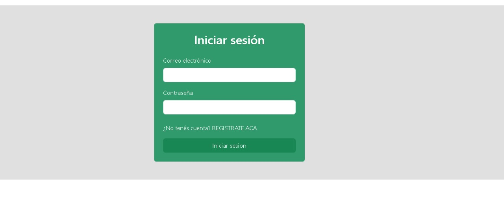

# E-commerce hecha con react vite: BuyAny

## Link deploy: 
https://buyany.vercel.app/

## Funcionalidades y pantallas

El sitio cuenta con un home sencillo que incluye un carrousel asi como el muestreo de productos de varias categorias al mismo tiempo que muestra el header y el footer. Todo envuelto en un diseño minimalista e intuitivo para el usuario

***
***

Cuando se clickea en un producto, como en las grandes e-commerce, se puede visualizar un panel con los detalles del mismo asi como tambien se proporciona la opcion de agregar al carrito o comprar la cantidad deseada.

***
***

El login, tan intuitivo como el resto de la pagina, incluye una autenticacion basica con firebase para asegurar el buen funcionamiento del sitio. Se puede loguear y crear usuarios con mail + contraseña

***
***

El carrito de compras permite gestionar la compra del usuario en su sesión actual (cuando cierra sesión se borra el carro); agregarle productos, quitarle, modificarle las cantidades, y proceder a la compra final donde simulará el pago y el sitio guardará un comprobante de la operación.

